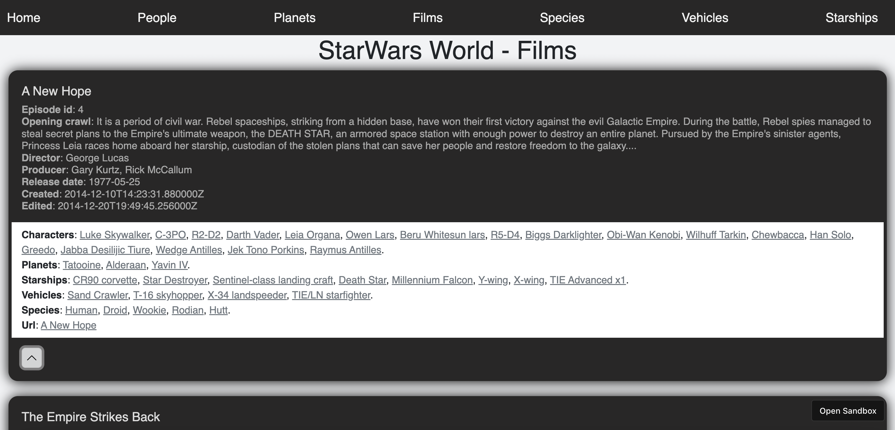

# **Star Wars API Project**

## **Introduction**

## **Project description**

This is a basic webpage displaying items like lists of people, planets, films, species, vehicles, and starships from the [Star Wars API](https://swapi.dev/api/) (https://swapi.dev/). 

In this project, you could find:

* created HTML for the page
* styled elements on the page using CSS
* retrieved data to display on the page using JavaScript to fetch the data from the [Star Wars API](https://swapi.dev/api/) (https://swapi.dev/)
* README file that includes the project description, its features, and instructions for running the webpage

You can see it live at: [https://hu00xv.csb.app/](https://hu00xv.csb.app/)

### **Features**

* Main Page
* Horizontal Top Main menu
* Simple navigation through the whole web page (Provided a way for the user to navigate between the different models)
* The ability to navigate to all sections of swapi.dev like people, planets, films, species, vehicles, starships 
* The ability to display all elements and information about them that belong to a certain section category 
* Pagination on pages with multiple results (at the bottom of the page)
* The ability to output data separately for each element from each section: for each people, planet, film, species, vehicle and starship
* Implemented a check which checks that all of the data that are shown exists for each entity
* Collapsing cards to show/hide additional information for each item
* Pretty well-designed GUI
* Included a simple set of styling 

## **Installation**

**Run**

**Locally**

To start the app locally, run:
